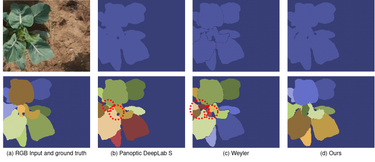

# Hierarchical Approach for Joint Semantic, Plant Instance, and Leaf Instance Segmentation in the Agricultural Domain

This repo contains the code of the paper *Hierarchical Approach for Joint Semantic, Plant Instance, and Leaf Instance Segmentation in the Agricultural Domain*, by [G. Roggiolani](https://github.com/theroggio) and [M. Sodano](https://github.com/matteosodano) et al., submitted to the IEEE International Conference on Robotics and Automation (ICRA) 2023. [Link](https://arxiv.org/pdf/2210.07879.pdf) to the ArXiv version of the paper.

## Abstract
Plant phenotyping is a central task in agriculture, as it describes plants’  growth stage, development, and other relevant quantities. Robots can help automate this process by accurately estimating plant traits such as the number of leaves, leaf area, and the plant size. In this paper, we address the problem of joint semantic, plant instance, and leaf instance segmentation of crop fields from RGB data. We propose a single convolutional neural network that addresses the three tasks simultaneously, exploiting their underlying hierarchical structure. We introduce task-specific skip connections, which our experimental evaluation proves to be more beneficial than the usual schemes. We also propose a novel automatic post-processing, which explicitly addresses the problem of spatially close instances, common in the agricultural domain because of overlapping leaves. Our architecture simultaneously tackles these problems jointly in the agricultural context. Previous works either focus on plant or leaf segmentation, or do not optimise for semantic segmentation. Results show that our system has superior performance to state-of-the-art approaches, while having a reduced number of parameters and is operating at camera frame rate.

## Results
Quantitative results of our method against baselines:

|Method|Plants|Leaves|Dataset|IoU|PQ_P|PQ_L|Params|FPS|
|:------:|:-------:|:------:|:-----:|:-----:|:-----:|:-----:|:-----:|:-----:|
|Mask R-CNN|:heavy_check_mark:||SugarBeets|46.2|47.7||43.9M|13.5|
|Panoptic DeepLab S|:heavy_check_mark:||SugarBeets|75.4|69.4||7.7M|93.5|
|Panoptic DeepLab M|:heavy_check_mark:||SugarBeets|75.5|69.8||43.9M|4.7|
|Panoptic DeepLab L|:heavy_check_mark:||SugarBeets|76.4|71.1||43.9M|48.4|
|Mask R-CNN||:heavy_check_mark:|SugarBeets|64.9||53.6|43.9M|13.4|
|Panoptic DeepLab S||:heavy_check_mark:|SugarBeets|75.4||50.8|43.9M|93.7|
|Panoptic DeepLab M||:heavy_check_mark:|SugarBeets|76.7||54.4|43.9M|49.1|
|Panoptic DeepLab L||:heavy_check_mark:|SugarBeets|76.3||52.9|43.9M|48.5|
|Weyler|:heavy_check_mark:|:heavy_check_mark:|SugarBeets|75.3|72.3|63.1|43.9M|0.24|
|Ours|:heavy_check_mark:|:heavy_check_mark:|SugarBeets|**79.3**|**76.2**|**63.5**|43.9M|26.3|

|Method|Plants|Leaves|Dataset|IoU|PQ_P|PQ_L|Params|FPS|
|:------:|:-------:|:------:|:-----:|:-----:|:-----:|:-----:|:-----:|:-----:|
|Mask R-CNN|:heavy_check_mark:||GrowliFlower|25.4|27.9||43.9M|9.6|
|Panoptic DeepLab S|:heavy_check_mark:||GrowliFlower|83.1|69.9||7.7M|43.4|
|Panoptic DeepLab M|:heavy_check_mark:||GrowliFlower|82.0|68.0||43.9M|47.6|
|Panoptic DeepLab L|:heavy_check_mark:||GrowliFlower|82.7|69.4||43.9M|23.8|
|Mask R-CNN||:heavy_check_mark:|GrowliFlower|53.8||41.0|43.9M|16.2|
|Panoptic DeepLab S||:heavy_check_mark:|GrowliFlower|**84.4**||58.8|43.9M|76.5|
|Panoptic DeepLab M||:heavy_check_mark:|GrowliFlower|80.2||43.4|43.9M|41.6|
|Panoptic DeepLab L||:heavy_check_mark:|GrowliFlower|82.8||50.1|43.9M|30.3|
|Weyler|:heavy_check_mark:|:heavy_check_mark:|GrowliFlower|65.8|67.8|69.4|43.9M|0.53|
|Ours|:heavy_check_mark:|:heavy_check_mark:|GrowliFlower|80.2|**89.2**|**71.0**|43.9M|26.3|

<br/>

Qualitative results of our method against baselines on the GrowliFlower dataset, where red circles indicate segmentation errors:


Check out the [paper]() for more quantitative and qualitative results! :grin:


## Code
After installing the requirements specified in the file `requirements.yml` (for example in form of a conda environment), for training your model you only need to `python train_hapt.py` and specify your favourite settings in `config/config.yaml`.


## Citation
If you use our framework for any academic work, please cite the original [paper](https://arxiv.org/pdf/2210.07879.pdf)!

```
@article{roggiolani2022hierarchical,
  title={Hierarchical Approach for Joint Semantic, Plant Instance, and Leaf Instance Segmentation in the Agricultural Domain},
  author={Roggiolani, Gianmarco and Sodano, Matteo and Guadagnino, Tiziano and Magistri, Federico and Behley, Jens and Stachniss, Cyrill},
  journal={arXiv preprint arXiv:2210.07879},
  year={2022}
}
```

## Acknowledgment
This work has partially been funded by the Deutsche Forschungsgemeinschaft (DFG, German Research Foundation) under Germany's Excellence Strategy, EXC-2070 -- 390732324 -- [PhenoRob](https://www.phenorob.de/), and by the Deutsche Forschungsgemeinschaft (DFG, German Research Foundation) under STA 1051/5-1 within the FOR 5351(AID4Crops).
